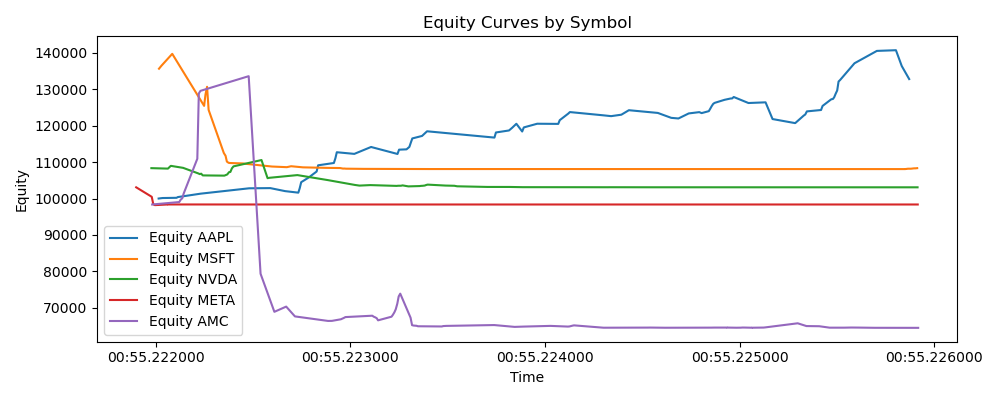

# Backtest Performance Report

## Key Metrics

| Metric | Value |
|---|---:|
| Initial equity | 98362.70 |
| Final equity | 64506.10 |
| Total return | -34.42% |
| Sharpe (ann.) | -0.687 |
| Max drawdown | 51.71% |

## Equity Curve

## Short interpretation

This report shows the basic metrics computed from the backtest. Sharpe ratio is a simple mean/std annualized assuming 252 periods/year. Max drawdown is the largest peak-to-trough decline observed.
