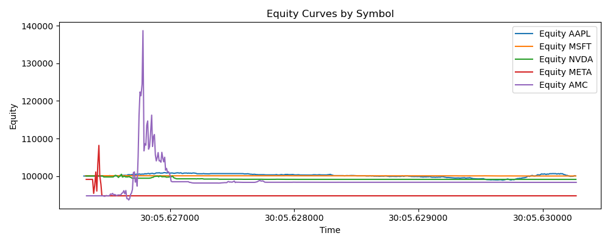

# Backtest Performance Report

## Key Metrics

| Metric | Value |
|---|---:|
| Initial equity | 94730.40 |
| Final equity | 98311.50 |
| Total return | 3.78% |
| Sharpe (ann.) | 0.207 |
| Max drawdown | 29.28% |

## Equity Curve

## Short interpretation

This report shows the basic metrics computed from the backtest. Sharpe ratio is a simple mean/std annualized assuming 252 periods/year. Max drawdown is the largest peak-to-trough decline observed.
